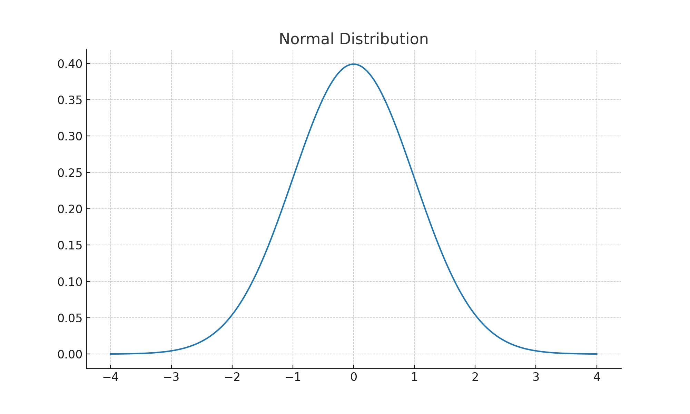
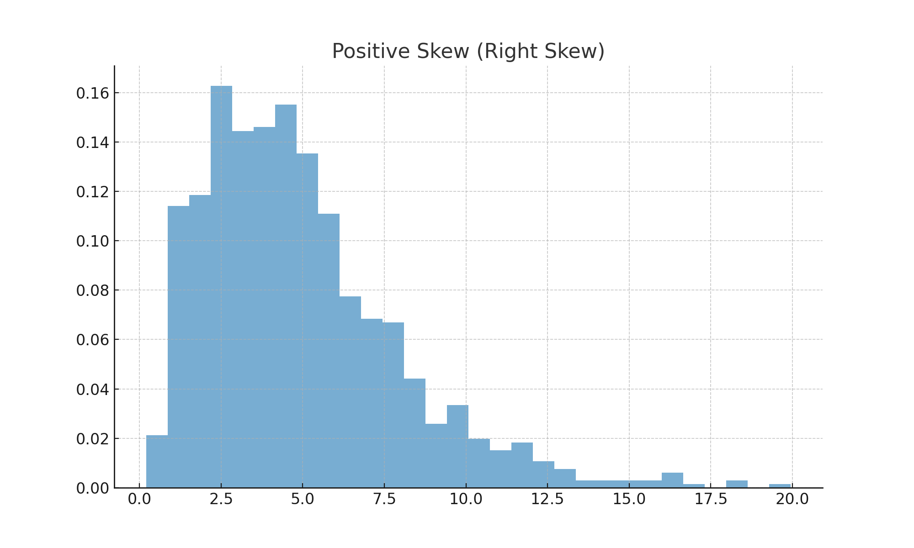
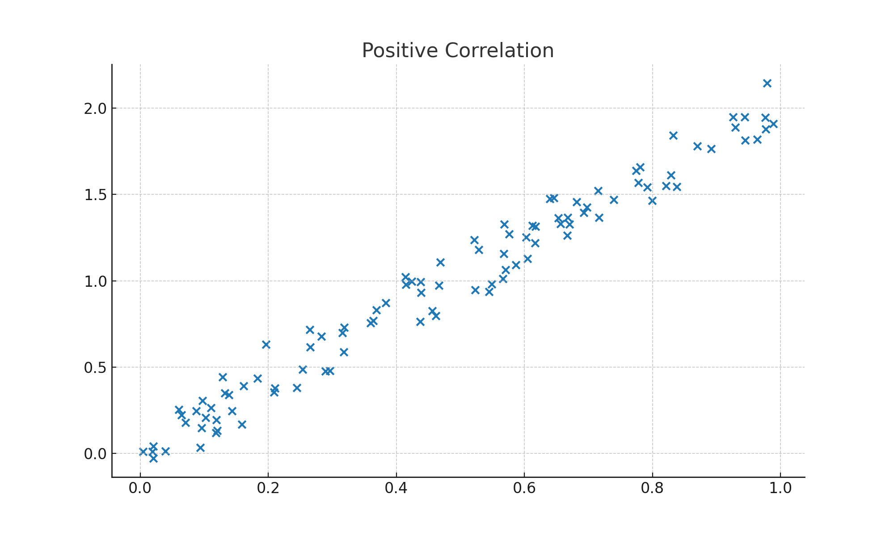
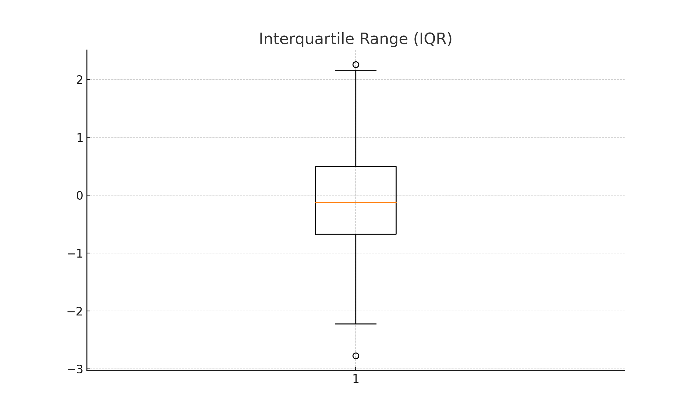

# 📊 Data Science Statistical Concepts Cheat Sheet  

This document summarizes **common statistical terms** used in Data Science, along with their **definitions, formulas, analogies, and visuals**.  

---

## 1. Mean (Arithmetic Average)  
**Definition:** The central average of a dataset.  
**Formula:**  
\[ \mu = \frac{1}{n} \sum_{i=1}^n x_i \]  
**Analogy:** Splitting a bill equally among friends at dinner.  

---

## 2. Median  
**Definition:** The middle value when the dataset is ordered. Less affected by outliers than the mean.  
**Analogy:** The student standing in the middle when everyone lines up by height.  

---

## 3. Mode  
**Definition:** The most frequently occurring value in the dataset.  
**Analogy:** The most popular ice cream flavor among a group of people.  

---

## 4. Range  
**Definition:** Difference between the largest and smallest values.  
**Formula:**  
\[ \text{Range} = \max(X) - \min(X) \]  
**Analogy:** The height difference between the tallest and shortest student.  

---

## 5. Variance (σ²)  
**Definition:** A measure of how spread out the data is from the mean.  
**Formula:**  
\[ \text{Var}(X) = \frac{1}{n} \sum_{i=1}^n (x_i - \mu)^2 \]  
**Analogy:** How far students are scattered around their teacher.  

---

## 6. Standard Deviation (σ)  
**Definition:** The square root of variance; average distance from the mean.  
**Formula:**  
\[ \sigma = \sqrt{\text{Var}(X)} \]  
**Analogy:** The typical distance each student is from the teacher.  

---

## 7. Coefficient of Variation (CV)  
**Definition:** A normalized measure of spread, useful for comparing datasets of different scales.  
**Formula:**  
\[ CV = \frac{\sigma}{\mu} \]  
**Analogy:** Comparing how noisy two classrooms are, regardless of class size.  

---

## 8. Normal Distribution  
**Definition:** A symmetric bell-shaped distribution where most data points cluster around the mean.  
**Formula:**  
\[ f(x) = \frac{1}{\sigma \sqrt{2\pi}} e^{-\frac{(x-\mu)^2}{2\sigma^2}} \]  
**Analogy:** Most people are of average height, while very short or very tall people are rare.  

  

---

## 9. Skewness (γ₁)  
**Definition:** A measure of the asymmetry of a distribution.  
**Formula:**  
\[ \text{Skewness} = \frac{\frac{1}{n}\sum (x_i - \mu)^3}{\sigma^3} \]  
- Positive Skew → long right tail.  
- Negative Skew → long left tail.  

**Analogy:** Income distribution is often positively skewed (a few very high incomes).  

  

---

## 10. Kurtosis (γ₂)  
**Definition:** A measure of "tailedness" of a distribution.  
**Formula:**  
\[ \text{Kurtosis} = \frac{\frac{1}{n}\sum (x_i - \mu)^4}{\sigma^4} \]  
- High Kurtosis → heavy tails (many outliers).  
- Low Kurtosis → light tails (few outliers).  

**Analogy:** Throwing darts: heavy tails = darts all over; light tails = darts clustered.  

---

## 11. Covariance  
**Definition:** Shows whether two variables move together.  
**Formula:**  
\[ \text{Cov}(X,Y) = \frac{1}{n} \sum (x_i - \bar{x})(y_i - \bar{y}}) \]  
- Positive → increase together.  
- Negative → one increases, other decreases.  

**Analogy:** Two friends walking: same direction = positive covariance, opposite = negative.  

---

## 12. Correlation Coefficient (r)  
**Definition:** Measures the strength & direction of a linear relationship between variables.  
**Formula:**  
\[ r = \frac{\sum (x_i - \bar{x})(y_i - \bar{y})}{\sqrt{\sum (x_i - \bar{x})^2} \cdot \sqrt{\sum (y_i - \bar{y})^2}} \]  
- Range: -1 ≤ r ≤ 1.  

**Analogy:** Study time vs. exam score → strong positive correlation.  

  

---

## 13. Percentiles & Quartiles  
**Definition:**  
- Percentile: Value below which a certain % of data falls.  
- Quartiles: 25% (Q1), 50% (Q2 = Median), 75% (Q3).  

**Analogy:** Being in the 90th percentile means scoring higher than 90% of students.  

---

## 14. Interquartile Range (IQR)  
**Definition:** Spread of the middle 50% of the data.  
**Formula:**  
\[ IQR = Q3 - Q1 \]  
**Analogy:** Height difference ignoring the tallest and shortest extremes.  

  

---

## 15. Z-Score  
**Definition:** Number of standard deviations a value is from the mean.  
**Formula:**  
\[ z = \frac{x - \mu}{\sigma} \]  
**Analogy:** If average exam score is 70 and you got 85, z tells you how much better you did compared to average.  

---

## 16. p-Value  
**Definition:** Probability of observing results as extreme as the data if the null hypothesis is true.  
- Small p-value → stronger evidence against null hypothesis.  

**Analogy:** Rolling five sixes in a row on a fair die → very small p-value, suggests die may be biased.  

---

## 17. Confidence Interval (CI)  
**Definition:** Range of values likely containing the true population parameter.  
**Example:** "The average height is 170 ± 2 cm (95% CI)."  

**Analogy:** Casting a net in the ocean — 95% of the time, the fish (true mean) is inside.  

---

# ⚡ Quick Reference Table  

| Concept                  | Symbol  | Formula | Key Idea |
|---------------------------|---------|---------|----------|
| Mean                     | μ       | (Σx)/n | Arithmetic average |
| Median                   | –       | – | Middle of dataset |
| Mode                     | –       | – | Most frequent value |
| Range                    | –       | Max – Min | Spread of extremes |
| Variance                 | σ²      | (Σ(x-μ)²)/n | Spread around mean |
| Standard Deviation       | σ       | √Var(X) | Avg. distance from mean |
| Coefficient of Variation | CV      | σ/μ | Spread relative to mean |
| Percentiles/Quartiles    | Q1,Q2,Q3 | – | Distribution cut points |
| Interquartile Range      | IQR     | Q3 – Q1 | Middle 50% spread |
| Covariance               | Cov(X,Y) | (Σ(x- x̄)(y- ȳ))/n | Joint variability |
| Correlation Coefficient  | r       | See formula | Strength/direction |
| Z-Score                  | z       | (x-μ)/σ | Std. deviations from mean |
| Skewness                 | γ₁      | (Σ(x-μ)³)/(nσ³) | Distribution asymmetry |
| Kurtosis                 | γ₂      | (Σ(x-μ)⁴)/(nσ⁴) | Tailedness |
| p-Value                  | p       | – | Evidence against null |
| Confidence Interval      | CI      | – | Range of likely values |
| Normal Distribution      | –       | Bell curve formula | Gaussian shape |

---

✅ Use this as a **complete visual statistical cheat sheet** for **Data Science interview prep** and reference.  
